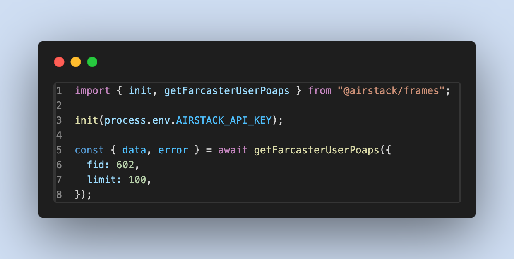
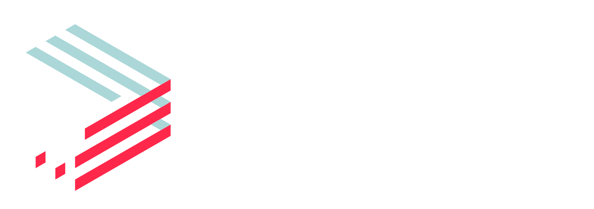

<div align="center">
  <h1 align="center">Official Airstack Frames SDK</h1>
  
  <h3>Powered By</h3>
  <a align="center" href="https://airstack.xyz" target="_blank"></a>
</div>

The Airstack Frames SDK empowers developers to seamlessly integrate onchain data, including token balances, token mints, Farcaster followers and followings, POAPs, and more, into their Frames using just a few lines of code.

Additionally, developers can leverage the SDK to create an allow list feature, enabling checks for token ownership, token mints, following status, and more.

Designed with TypeScript, the SDK offers full type support for those building Frames with TypeScript.

## Table Of Contents

- [Table Of Contents](#table-of-contents)
- [Install](#install)
- [Set Environment Variables](#set-environment-variables)
- [Get Started](#get-started)
- [Functions](#functions)
  - [`getTrendingMints`](#gettrendingmints)
  - [`getFarcasterUserDetails`](#getfarcasteruserdetails)
  - [`getFarcasterFollowers`](#getfarcasterfollowers)
  - [`getFarcasterFollowings`](#getfarcasterfollowings)
  - [`getFarcasterUserPoaps`](#getfarcasteruserpoaps)
  - [`getFarcasterUserERC20Balances`](#getfarcasterusererc20balances)
  - [`getFarcasterUserNFTBalances`](#getfarcasterusernftbalances)
  - [`getFarcasterUserERC20Mints`](#getfarcasterusererc20mints)
  - [`getFarcasterUserNFTMints`](#getfarcasterusernftmints)
  - [`getFarcasterUserTokenSentFrom`](#getfarcasterusertokensentfrom)
  - [`getFarcasterUserTokenReceivedBy`](#getfarcasterusertokenreceivedby)
  - [`getFarcasterChannelDetails`](#getfarcasterchanneldetails)
  - [`getFarcasterChannelParticipants`](#getfarcasterchannelparticipants)
  - [`getFarcasterChannelsByParticipant`](#getfarcasterchannelsbyparticipant)
  - [`getFarcasterChannelsByHost`](#getfarcasterchannelsbyhost)
  - [`searchFarcasterChannels`](#searchfarcasterchannels)
  - [`searchFarcasterUsers`](#searchfarcasterusers)
  - [`checkPoapAttendedByFarcasterUser`](#checkpoapattendedbyfarcasteruser)
  - [`checkTokenHoldByFarcasterUser`](#checktokenholdbyfarcasteruser)
  - [`checkTokenMintedByFarcasterUser`](#checktokenmintedbyfarcasteruser)
  - [`checkIsFollowingFarcasterUser`](#checkisfollowingfarcasteruser)
  - [`checkIsFollowedByFarcasterUser`](#checkisfollowedbyfarcasteruser)
  - [`validateFramesMessage`](#validateframesmessage)
  - [`fetchQuery`](#fetchquery)
  - [`fetchQueryWithPagination`](#fetchquerywithpagination)
- [Enum](#enum)
  - [`TokenBlockchain`](#tokenblockchain)
  - [`TokenType`](#tokentype)
  - [`NFTType`](#nfttype)
  - [`FarcasterChannelActionType`](#farcasterchannelactiontype)
  - [`Audience`](#audience)
  - [`Criteria`](#criteria)
  - [`TimeFrame`](#timeframe)
- [Paginations](#paginations)

## Install

To install the Frames SDK, use the command below:

```bash
npm install @airstack/frames
```

## Set Environment Variables

Create a `.env.local` file and add your [Airstack API key](https://app.airstack.xyz/profile-settings/api-keys) as an environment variable:

```
AIRSTACK_API_KEY="YOUR_AIRSTACK_API_KEY"
```

## Get Started

To use any of the functions offered by the SDK, you'll need to call the `init` function before calling the functions and input your [Airstack API key](https://app.airstack.xyz/profile-settings/api-keys).

```ts
import { init } from "@airstack/frames";

init(process.AIRSTACK_API_KEY);
```

## Functions

### `getTrendingMints`

Get trending mints in a given time frame by simply specifying the audience, criteria, and time frame that you prefer. All analysis and sorting will be done for you and you simply just need to receive the response from this function.

**Input**

| Field       | Type        | Required | Description                                                                                           |
| ----------- | ----------- | -------- | ----------------------------------------------------------------------------------------------------- |
| `audience`  | `Audience`  | true     | The audience to get trending mints for                                                                |
| `criteria`  | `Criteria`  | true     | The criteria to analyze and sort trending mints                                                       |
| `timeFrame` | `TimeFrame` | true     | The time frame to analyze the trending mints, e.g. the last 1 hour                                    |
| `limit`     | `number`    | false    | Number of results per pages. Maximum value is 200. For more results, use [paginations](#paginations). |

**Code Samples**

```ts
import {
  getTrendingMints,
  GetTrendingMintsInput,
  GetTrendingMintsOutput,
  Audience,
  Criteria,
  TimeFrame,
} from "@airstack/frames";

const input: GetTrendingMintsInput = {
  audience: Audience.All,
  criteria: Criteria.UniqueWallets,
  timeFrame: TimeFrame.OneDay,
  limit: 100,
};
const { data, error }: GetTrendingMintsOutput = await getTrendingMints(input);

if (error) throw new Error(error);

console.log(data);
```

**Response Samples**

```json
[
  {
    "address": "0x9d70ccd59b3124e5227a9148413892f947697afd",
    "erc1155TokenID": "",
    "criteriaCount": 1880,
    "timeFrom": "2024-03-07T15:17:00Z",
    "timeTo": "2024-03-08T14:52:00Z",
    "name": "Base's 2024 Mission, Strategy and Roadmap",
    "symbol": "BASES2024MISSIONSTRATEGYANDROADMAP",
    "type": "ERC721"
  }
]
```

### `getFarcasterUserDetails`

Fetch Farcaster user details, including profile name, fnames, profile images (resized), user-associated addresses (connected addresses), follower count and following count.

**Input**

| Field | Type     | Required | Description             |
| ----- | -------- | -------- | ----------------------- |
| `fid` | `number` | true     | FID of a Farcaster user |

**Code Sample**

```ts
import {
  getFarcasterUserDetails,
  FarcasterUserDetailsInput,
  FarcasterUserDetailsOutput,
} from "@airstack/frames";

const input: FarcasterUserDetailsInput = {
  fid: 602,
};
const { data, error }: FarcasterUserDetailsOutput =
  await getFarcasterUserDetails(input);

if (error) throw new Error(error);

console.log(data);
```

**Response Sample**

```json
{
  "profileName": "betashop.eth",
  "fnames": ["betashop", "betashop.eth", "jasongoldberg.eth"],
  "profileImage": {
    "extraSmall": "https://assets.airstack.xyz/image/social/TQjjhuaajVkwqgzZVvgFQYU1qxNfVHQgSmZjTcXRrzQ=/extra_small.png",
    "small": "https://assets.airstack.xyz/image/social/TQjjhuaajVkwqgzZVvgFQYU1qxNfVHQgSmZjTcXRrzQ=/small.png",
    "medium": "https://assets.airstack.xyz/image/social/TQjjhuaajVkwqgzZVvgFQYU1qxNfVHQgSmZjTcXRrzQ=/medium.png",
    "large": "https://assets.airstack.xyz/image/social/TQjjhuaajVkwqgzZVvgFQYU1qxNfVHQgSmZjTcXRrzQ=/large.png",
    "original": "https://assets.airstack.xyz/image/social/TQjjhuaajVkwqgzZVvgFQYU1qxNfVHQgSmZjTcXRrzQ=/original_image.png"
  },
  "userAssociatedAddresses": [
    "0x66bd69c7064d35d146ca78e6b186e57679fba249",
    "0xeaf55242a90bb3289db8184772b0b98562053559"
  ],
  "followerCount": 56141,
  "followingCount": 2270
}
```

### `getFarcasterFollowers`

Fetch all Farcaster followers of a given FID.

**Input**

| Field   | Type     | Required | Description                                                                                           |
| ------- | -------- | -------- | ----------------------------------------------------------------------------------------------------- |
| `fid`   | `number` | true     | FID of a Farcaster user                                                                               |
| `limit` | `number` | false    | Number of results per pages. Maximum value is 200. For more results, use [paginations](#paginations). |

**Code Sample**

```ts
import {
  getFarcasterFollowers,
  FarcasterFollowersInput,
  FarcasterFollowersOutput,
} from "@airstack/frames";

const input: FarcasterFollowersInput = {
  fid: 602,
  limit: 100,
};
const {
  data,
  error,
  hasNextPage,
  hasPrevPage,
  getNextPage,
  getPrevPage,
}: FarcasterFollowersOutput = await getFarcasterFollowers(input);

if (error) throw new Error(error);

console.log(data);
```

**Response Sample**

```json
[
  {
    "profileName": "allison985",
    "fnames": ["allison985"],
    "fid": "220757",
    "profileImage": {
      "extraSmall": "https://assets.airstack.xyz/image/social/RS9r7sdCb5orXeB0+tLLRPxtnJo80la3zRRVAYc9gPR+ne8TitCLgEJ41Gp1LV6g/extra_small.jpg",
      "small": "https://assets.airstack.xyz/image/social/RS9r7sdCb5orXeB0+tLLRPxtnJo80la3zRRVAYc9gPR+ne8TitCLgEJ41Gp1LV6g/small.jpg",
      "medium": "https://assets.airstack.xyz/image/social/RS9r7sdCb5orXeB0+tLLRPxtnJo80la3zRRVAYc9gPR+ne8TitCLgEJ41Gp1LV6g/medium.jpg",
      "large": "https://assets.airstack.xyz/image/social/RS9r7sdCb5orXeB0+tLLRPxtnJo80la3zRRVAYc9gPR+ne8TitCLgEJ41Gp1LV6g/large.jpg",
      "original": "https://assets.airstack.xyz/image/social/RS9r7sdCb5orXeB0+tLLRPxtnJo80la3zRRVAYc9gPR+ne8TitCLgEJ41Gp1LV6g/original_image.jpg"
    },
    "userAssociatedAddresses": ["0x42fae5a53f0194f6f9587926e206a852c5c726bf"],
    "followerCount": 1,
    "followingCount": 74
  }
]
```

### `getFarcasterFollowings`

Fetch all Farcaster followings of a given FID.

**Input**

| Field   | Type     | Required | Description                                                                                           |
| ------- | -------- | -------- | ----------------------------------------------------------------------------------------------------- |
| `fid`   | `number` | true     | FID of a Farcaster user                                                                               |
| `limit` | `number` | false    | Number of results per pages. Maximum value is 200. For more results, use [paginations](#paginations). |

**Code Sample**

```ts
import {
  getFarcasterFollowings,
  FarcasterFollowingsInput,
  FarcasterFollowingsOutput,
} from "@airstack/frames";

const input: FarcasterFollowingsInput = {
  fid: 602,
  limit: 100,
};
const {
  data,
  error,
  hasNextPage,
  hasPrevPage,
  getNextPage,
  getPrevPage,
}: FarcasterFollowingsOutput = await getFarcasterFollowings(input);

if (error) throw new Error(error);

console.log(data);
```

**Response Sample**

```json
[
  {
    "profileName": "jayhuq",
    "fnames": ["jayhuq"],
    "fid": "1775",
    "profileImage": {
      "extraSmall": "https://assets.airstack.xyz/image/social/HmDDiN8HQWR/6f6nrPI8+P6fwctlKaEu/dM8+QnZz/Y=/extra_small.png",
      "small": "https://assets.airstack.xyz/image/social/HmDDiN8HQWR/6f6nrPI8+P6fwctlKaEu/dM8+QnZz/Y=/small.png",
      "medium": "https://assets.airstack.xyz/image/social/HmDDiN8HQWR/6f6nrPI8+P6fwctlKaEu/dM8+QnZz/Y=/medium.png",
      "large": "https://assets.airstack.xyz/image/social/HmDDiN8HQWR/6f6nrPI8+P6fwctlKaEu/dM8+QnZz/Y=/large.png",
      "original": "https://assets.airstack.xyz/image/social/HmDDiN8HQWR/6f6nrPI8+P6fwctlKaEu/dM8+QnZz/Y=/original_image.png"
    },
    "userAssociatedAddresses": ["0xda52abca28fadeab9771ba45a2ff346c4db97d7f"],
    "followerCount": 58,
    "followingCount": 0
  }
]
```

### `getFarcasterUserPoaps`

Fetch all POAPs owned by a Farcaster user of a given FID.

**Input**

| Field   | Type     | Required | Description                                                                                           |
| ------- | -------- | -------- | ----------------------------------------------------------------------------------------------------- |
| `fid`   | `number` | true     | FID of a Farcaster user                                                                               |
| `limit` | `number` | false    | Number of results per pages. Maximum value is 200. For more results, use [paginations](#paginations). |

**Code Sample**

```ts
import {
  getFarcasterUserPoaps,
  FarcasterUserPoapsInput,
  FarcasterUserPoapsOutput,
} from "@airstack/frames";

const input: FarcasterUserPoapsInput = {
  fid: 602,
  limit: 100,
};
const {
  data,
  error,
  hasNextPage,
  hasPrevPage,
  getNextPage,
  getPrevPage,
}: FarcasterUserPoapsOutput = await getFarcasterUserPoaps(input);

if (error) throw new Error(error);

console.log(data);
```

**Response Sample**

```json
[
  {
    "eventName": "ETHGlobal New York 2023 Speaker",
    "eventId": "151055",
    "eventURL": "https://ethglobal.com/events/newyork2023",
    "isVirtualEvent": false,
    "startDate": "2023-09-22T00:00:00Z",
    "endDate": "2023-09-25T00:00:00Z",
    "city": "New York City"
  }
]
```

### `getFarcasterUserERC20Balances`

Fetch ERC20 tokens owned by a Farcaster user of a given FID across Ethereum, Polygon, Base, and Zora.

**Input**

| Field    | Type                                    | Required | Description                                                                                                                                              |
| -------- | --------------------------------------- | -------- | -------------------------------------------------------------------------------------------------------------------------------------------------------- |
| `fid`    | `number`                                | true     | FID of a Farcaster user                                                                                                                                  |
| `chains` | [`TokenBlockchain[]`](#tokenblockchain) | false    | List of blockchains to fetch user's ERC20 balance. Currently, supports Ethereum, Polygon, Base, and Zora. Defaults to include all supported blockchains. |
| `limit`  | `number`                                | false    | Number of results per pages. Maximum value is 200. For more results, use [paginations](#paginations).                                                    |

**Code Sample**

```ts
import {
  getFarcasterUserERC20Balances,
  FarcasterUserERC20BalancesInput,
  FarcasterUserERC20BalancesOutput,
  TokenBlockchain,
} from "@airstack/frames";

const input: FarcasterUserERC20BalancesInput = {
  fid: 602,
  chains: [
    TokenBlockchain.Ethereum,
    TokenBlockchain.Polygon,
    TokenBlockchain.Base,
    TokenBlockchain.Zora,
  ],
  limit: 100,
};
const {
  data,
  error,
  hasNextPage,
  hasPrevPage,
  getNextPage,
  getPrevPage,
}: FarcasterUserERC20BalancesOutput = await getFarcasterUserERC20Balances(
  input
);

if (error) throw new Error(error);

console.log(data);
```

**Response Sample**

```json
[
  {
    "blockchain": "ethereum",
    "tokenAddress": "0xa0b86991c6218b36c1d19d4a2e9eb0ce3606eb48",
    "amount": 125,
    "amountInWei": "125000000",
    "name": "USD Coin",
    "symbol": "USDC"
  }
]
```

### `getFarcasterUserNFTBalances`

Fetch ERC721 and ERC1155 NFT collections owned by a Farcaster user of a given FID across Ethereum, Polygon, Base, and Zora.

**Input**

| Field       | Type                                    | Required | Description                                                                                                                                            |
| ----------- | --------------------------------------- | -------- | ------------------------------------------------------------------------------------------------------------------------------------------------------ |
| `fid`       | `number`                                | true     | FID of a Farcaster user                                                                                                                                |
| `chains`    | [`TokenBlockchain[]`](#tokenblockchain) | false    | List of blockchains to fetch user's NFT balance. Currently, supports Ethereum, Polygon, Base, and Zora. Defaults to include all supported blockchains. |
| `tokenType` | [`TokenType[]`](#tokentype)             | false    | Fetch only NFT balances that has the same time with this input. Defaults to include all ERC721 and 1155 NFTs.                                          |
| `limit`     | `number`                                | false    | Number of results per pages. Maximum value is 200. For more results, use [paginations](#paginations).                                                  |

**Code Sample**

```ts
import {
  getFarcasterUserNFTBalances,
  FarcasterUserNFTBalancesInput,
  FarcasterUserNFTBalancesOutput,
  TokenBlockchain,
  NFTType,
} from "@airstack/frames";

const variables: FarcasterUserNFTBalancesInput = {
  fid: 602,
  tokenType: [NFTType.ERC721, NFTType.ERC1155],
  chains: [
    TokenBlockchain.Ethereum,
    TokenBlockchain.Polygon,
    TokenBlockchain.Base,
    TokenBlockchain.Zora,
  ],
  limit: 100,
};
const {
  data,
  error,
  hasNextPage,
  hasPrevPage,
  getNextPage,
  getPrevPage,
}: FarcasterUserNFTBalancesOutput = await getFarcasterUserNFTBalances(
  variables
);

if (error) throw new Error(error);

console.log(data);
```

**Response Sample**

```json
[
  {
    "blockchain": "zora",
    "tokenAddress": "0xe03ef4b9db1a47464de84fb476f9baf493b3e886",
    "tokenId": "110",
    "amount": 1,
    "amountInWei": "1",
    "name": "Farcaster OG",
    "symbol": "$FCOG",
    "image": {
      "extraSmall": "https://assets.airstack.xyz/image/nft/7777777/PtYr9f5cHxXadiklS+Xzp805o/lFKCmd1jvpLmU58tO5UgOEdm56cjqIt1Gf/UK052NE4yYf2xmpwwrzjcDl+w==/extra_small.png",
      "small": "https://assets.airstack.xyz/image/nft/7777777/PtYr9f5cHxXadiklS+Xzp805o/lFKCmd1jvpLmU58tO5UgOEdm56cjqIt1Gf/UK052NE4yYf2xmpwwrzjcDl+w==/small.png",
      "medium": "https://assets.airstack.xyz/image/nft/7777777/PtYr9f5cHxXadiklS+Xzp805o/lFKCmd1jvpLmU58tO5UgOEdm56cjqIt1Gf/UK052NE4yYf2xmpwwrzjcDl+w==/medium.png",
      "large": "https://assets.airstack.xyz/image/nft/7777777/PtYr9f5cHxXadiklS+Xzp805o/lFKCmd1jvpLmU58tO5UgOEdm56cjqIt1Gf/UK052NE4yYf2xmpwwrzjcDl+w==/large.png",
      "original": "https://assets.airstack.xyz/image/nft/7777777/PtYr9f5cHxXadiklS+Xzp805o/lFKCmd1jvpLmU58tO5UgOEdm56cjqIt1Gf/UK052NE4yYf2xmpwwrzjcDl+w==/original_image.png"
    },
    "metaData": {
      "name": "Farcaster OG 43",
      "description": "Celebrating Farcaster at permissionless.",
      "image": "ipfs://bafybeihbx6nx4h2wblf6nlsy6nkotzqynzsrgimgqzwqgw6gf7d27ewfqu",
      "imageData": "",
      "externalUrl": "",
      "animationUrl": "",
      "youtubeUrl": "",
      "backgroundColor": "",
      "attributes": null
    },
    "tokenType": "ERC721"
  }
]
```

### `getFarcasterUserERC20Mints`

Fetch ERC20 tokens minted by a Farcaster user of a given FID across Ethereum, Polygon, Base, and Zora.

**Input**

| Field    | Type                                    | Required | Description                                                                                                                                            |
| -------- | --------------------------------------- | -------- | ------------------------------------------------------------------------------------------------------------------------------------------------------ |
| `fid`    | `number`                                | true     | FID of a Farcaster user                                                                                                                                |
| `chains` | [`TokenBlockchain[]`](#tokenblockchain) | false    | List of blockchains to fetch user's ERC20 mints. Currently, supports Ethereum, Polygon, Base, and Zora. Defaults to include all supported blockchains. |
| `limit`  | `number`                                | false    | Number of results per pages. Maximum value is 200. For more results, use [paginations](#paginations).                                                  |

**Code Sample**

```ts
import {
  getFarcasterUserERC20Mints,
  FarcasterUserERC20MintsInput,
  FarcasterUserERC20MintsOutput,
  TokenBlockchain,
} from "@airstack/frames";

const input: FarcasterUserERC20MintsInput = {
  fid: 602,
  chains: [
    TokenBlockchain.Ethereum,
    TokenBlockchain.Polygon,
    TokenBlockchain.Base,
    TokenBlockchain.Zora,
  ],
  limit: 100,
};
const {
  data,
  error,
  hasNextPage,
  hasPrevPage,
  getNextPage,
  getPrevPage,
}: FarcasterUserERC20MintsOutput = await getFarcasterUserERC20Mints(input);

if (error) throw new Error(error);

console.log(data);
```

**Response Sample**

```json
[
  {
    "blockchain": "polygon",
    "tokenAddress": "0x058d96baa6f9d16853970b333ed993acc0c35add",
    "amount": 50,
    "amountInWei": "50000000000000000000",
    "name": "Staked SPORK",
    "symbol": "sSPORK",
    "blockTimestamp": "2024-01-03T18:43:02Z",
    "blockNumber": 51901326
  }
]
```

### `getFarcasterUserNFTMints`

Fetch ERC721 and ERC1155 NFT collections minted by a Farcaster user of a given FID across Ethereum, Polygon, Base, and Zora.

**Input**

| Field       | Type                                    | Required | Description                                                                                                                                          |
| ----------- | --------------------------------------- | -------- | ---------------------------------------------------------------------------------------------------------------------------------------------------- |
| `fid`       | `number`                                | true     | FID of a Farcaster user                                                                                                                              |
| `chains`    | [`TokenBlockchain[]`](#tokenblockchain) | false    | List of blockchains to fetch user's NFT mints. Currently, supports Ethereum, Polygon, Base, and Zora. Defaults to include all supported blockchains. |
| `tokenType` | [`TokenType[]`](#tokentype)             | false    | Fetch only NFT mints that has the same time with this input. Defaults to include all ERC721 and 1155 NFTs.                                           |
| `limit`     | `number`                                | false    | Number of results per pages. Maximum value is 200. For more results, use [paginations](#paginations).                                                |

**Code Sample**

```ts
import {
  getFarcasterUserNFTMints,
  FarcasterUserNFTMintsInput,
  FarcasterUserNFTMintsOutput,
  TokenBlockchain,
  NFTType,
} from "@airstack/frames";

const input: FarcasterUserNFTMintsInput = {
  fid: 602,
  chains: [
    TokenBlockchain.Ethereum,
    TokenBlockchain.Polygon,
    TokenBlockchain.Base,
    TokenBlockchain.Zora,
  ],
  tokenType: [NFTType.ERC721, NFTType.ERC1155],
  limit: 100,
};
const {
  data,
  error,
  hasNextPage,
  hasPrevPage,
  getNextPage,
  getPrevPage,
}: FarcasterUserNFTMintsOutput = await getFarcasterUserNFTMints(input);

if (error) throw new Error(error);

console.log(data);
```

**Response Sample**

```json
[
  {
    "blockchain": "base",
    "tokenAddress": "0x7d5861cfe1c74aaa0999b7e2651bf2ebd2a62d89",
    "tokenId": "94613",
    "tokenType": "ERC721",
    "amount": 1,
    "amountInWei": "1",
    "name": "Base Day One",
    "symbol": "$BASEDAYONE",
    "blockTimestamp": "2023-08-11T08:23:43Z",
    "blockNumber": 2476438,
    "image": {
      "extraSmall": "https://assets.airstack.xyz/image/nft/8453/VsImj/jHMngFqJSF7KWaDce4NeMMkjjE6vKrM78PzD+4gKMh74NjmrMUXl9+slIronvYbTNTE8aDkB1TuYwHPA==/extra_small.gif",
      "small": "https://assets.airstack.xyz/image/nft/8453/VsImj/jHMngFqJSF7KWaDce4NeMMkjjE6vKrM78PzD+4gKMh74NjmrMUXl9+slIronvYbTNTE8aDkB1TuYwHPA==/small.gif",
      "medium": "https://assets.airstack.xyz/image/nft/8453/VsImj/jHMngFqJSF7KWaDce4NeMMkjjE6vKrM78PzD+4gKMh74NjmrMUXl9+slIronvYbTNTE8aDkB1TuYwHPA==/medium.gif",
      "large": "https://assets.airstack.xyz/image/nft/8453/VsImj/jHMngFqJSF7KWaDce4NeMMkjjE6vKrM78PzD+4gKMh74NjmrMUXl9+slIronvYbTNTE8aDkB1TuYwHPA==/large.gif",
      "original": "https://assets.airstack.xyz/image/nft/8453/VsImj/jHMngFqJSF7KWaDce4NeMMkjjE6vKrM78PzD+4gKMh74NjmrMUXl9+slIronvYbTNTE8aDkB1TuYwHPA==/original_image.gif"
    },
    "metaData": {
      "name": "Base Day One 94613",
      "description": "Base Day One commemorates the first day of Base. Watch it evolve as more people come onchain and collectively create our story. All proceeds will support the next generation of builders on Base; this does not confer any other rights. GET ONCHAIN at onchainsummer.xyz and mint to join us.",
      "image": "ipfs://bafybeidkxtd2qck3omiccqhi2iebklr5yfsm33vivmgyfarlh62l462zka",
      "imageData": "",
      "externalUrl": "",
      "animationUrl": "",
      "youtubeUrl": "",
      "backgroundColor": "",
      "attributes": null
    }
  }
]
```

### `getFarcasterUserTokenSentFrom`

Fetch all token transfers sent from a Farcaster user of a given FID across Ethereum, Polygon, Base, and Zora.

**Input**

| Field       | Type                                    | Required | Description                                                                                                                                                |
| ----------- | --------------------------------------- | -------- | ---------------------------------------------------------------------------------------------------------------------------------------------------------- |
| `fid`       | `number`                                | true     | FID of a Farcaster user                                                                                                                                    |
| `chains`    | [`TokenBlockchain[]`](#tokenblockchain) | false    | List of blockchains to fetch user's token transfers. Currently, supports Ethereum, Polygon, Base, and Zora. Defaults to include all supported blockchains. |
| `tokenType` | [`TokenType[]`](#tokentype)             | false    | Fetch only token transfers that transfered tokens within this input. Defaults to include all ERC20/721/1155 tokens.                                        |
| `limit`     | `number`                                | false    | Number of results per pages. Defaults to 200. Maximum value is 200. For more results, use [paginations](#paginations).                                     |

**Code Sample**

```ts
import {
  getFarcasterUserTokenSentFrom,
  FarcasterUserTokenSentFromInput,
  FarcasterUserTokenSentFromOutput,
  TokenBlockchain,
  TokenType,
} from "@airstack/frames";

const input: FarcasterUserTokenSentFromInput = {
  fid: 602,
  chains: [
    TokenBlockchain.Ethereum,
    TokenBlockchain.Polygon,
    TokenBlockchain.Base,
    TokenBlockchain.Zora,
  ],
  tokenType: [TokenType.ERC20, TokenType.ERC721, TokenType.ERC1155],
  limit: 100,
};
const {
  data,
  error,
  hasNextPage,
  hasPrevPage,
  getNextPage,
  getPrevPage,
}: FarcasterUserTokenSentFromOutput = await getFarcasterUserTokenSentFrom(
  input
);

if (error) throw new Error(error);

console.log(data);
```

**Response Sample**

```json
[
  {
    "blockchain": "base",
    "tokenAddress": "0x833589fcd6edb6e08f4c7c32d4f71b54bda02913",
    "amount": 100,
    "amountInWei": "100000000",
    "name": "USD Coin",
    "symbol": "USDC",
    "blockTimestamp": "2023-12-18T15:15:35Z",
    "blockNumber": 8061594,
    "tokenType": "ERC20",
    "txHash": "0xf30a550eece968e1abdcae4de3bdb5f7b84f3d0b2335150149a7398b351567f5",
    "receiver": {
      "addresses": ["0x3a23f943181408eac424116af7b7790c94cb97a5"],
      "socials": null
    }
  }
]
```

### `getFarcasterUserTokenReceivedBy`

Fetch all token transfers received by a Farcaster user of a given FID across Ethereum, Polygon, Base, and Zora.

**Input**

| Field       | Type                                    | Required | Description                                                                                                                                                |
| ----------- | --------------------------------------- | -------- | ---------------------------------------------------------------------------------------------------------------------------------------------------------- |
| `fid`       | `number`                                | true     | FID of a Farcaster user                                                                                                                                    |
| `chains`    | [`TokenBlockchain[]`](#tokenblockchain) | false    | List of blockchains to fetch user's token transfers. Currently, supports Ethereum, Polygon, Base, and Zora. Defaults to include all supported blockchains. |
| `tokenType` | [`TokenType[]`](#tokentype)             | false    | Fetch only token transfers that transfered tokens within this input. Defaults to include all ERC20/721/1155 tokens.                                        |
| `limit`     | `number`                                | false    | Number of results per pages. Defaults to 200. Maximum value is 200. For more results, use [paginations](#paginations).                                     |

**Code Sample**

```ts
import {
  getFarcasterUserTokenReceivedBy,
  FarcasterUserTokenReceivedByInput,
  FarcasterUserTokenReceivedByOutput,
  TokenBlockchain,
  TokenType,
} from "@airstack/frames";

const input: FarcasterUserTokenReceivedByInput = {
  fid: 602,
  chains: [
    TokenBlockchain.Ethereum,
    TokenBlockchain.Polygon,
    TokenBlockchain.Base,
    TokenBlockchain.Zora,
  ],
  tokenType: [TokenType.ERC20, TokenType.ERC721, TokenType.ERC1155],
  limit: 100,
};
const {
  data,
  error,
  hasNextPage,
  hasPrevPage,
  getNextPage,
  getPrevPage,
}: FarcasterUserTokenReceivedByOutput = await getFarcasterUserTokenReceivedBy(
  input
);

if (error) throw new Error(error);

console.log(data);
```

**Response Sample**

```json
[
  {
    "blockchain": "zora",
    "tokenAddress": "0xe03ef4b9db1a47464de84fb476f9baf493b3e886",
    "amount": 1,
    "amountInWei": "1",
    "name": "Farcaster OG",
    "symbol": "$FCOG",
    "blockTimestamp": "2023-10-11T21:02:39Z",
    "blockNumber": 5182160,
    "tokenType": "ERC721",
    "txHash": "0x116d7d7d2f6e8adb7b6991348ff1869742dae538f0b68f36624ed2496bc2091e",
    "sender": {
      "addresses": ["0x3a23f943181408eac424116af7b7790c94cb97a5"],
      "socials": null
    },
    "metaData": {
      "name": "Farcaster OG 43",
      "description": "Celebrating Farcaster at permissionless.",
      "image": "ipfs://bafybeihbx6nx4h2wblf6nlsy6nkotzqynzsrgimgqzwqgw6gf7d27ewfqu",
      "imageData": "",
      "externalUrl": "",
      "animationUrl": "",
      "youtubeUrl": "",
      "backgroundColor": "",
      "attributes": null
    },
    "image": {
      "extraSmall": "https://assets.airstack.xyz/image/nft/7777777/PtYr9f5cHxXadiklS+Xzp805o/lFKCmd1jvpLmU58tO5UgOEdm56cjqIt1Gf/UK052NE4yYf2xmpwwrzjcDl+w==/extra_small.png",
      "small": "https://assets.airstack.xyz/image/nft/7777777/PtYr9f5cHxXadiklS+Xzp805o/lFKCmd1jvpLmU58tO5UgOEdm56cjqIt1Gf/UK052NE4yYf2xmpwwrzjcDl+w==/small.png",
      "medium": "https://assets.airstack.xyz/image/nft/7777777/PtYr9f5cHxXadiklS+Xzp805o/lFKCmd1jvpLmU58tO5UgOEdm56cjqIt1Gf/UK052NE4yYf2xmpwwrzjcDl+w==/medium.png",
      "large": "https://assets.airstack.xyz/image/nft/7777777/PtYr9f5cHxXadiklS+Xzp805o/lFKCmd1jvpLmU58tO5UgOEdm56cjqIt1Gf/UK052NE4yYf2xmpwwrzjcDl+w==/large.png",
      "original": "https://assets.airstack.xyz/image/nft/7777777/PtYr9f5cHxXadiklS+Xzp805o/lFKCmd1jvpLmU58tO5UgOEdm56cjqIt1Gf/UK052NE4yYf2xmpwwrzjcDl+w==/original_image.png"
    },
    "tokenId": "110"
  }
]
```

### `getFarcasterChannelDetails`

Fetch all details of a given Farcaster channel, including name, description, warpcast URL, image URL, creation time, hosts, etc.

**Input**

| Field     | Type     | Required | Description                                                   |
| --------- | -------- | -------- | ------------------------------------------------------------- |
| `channel` | `string` | true     | Farcaster channel ID, e.g. /airstack channel ID is "airstack" |

**Code Sample**

```ts
import {
  getFarcasterChannelDetails,
  FarcasterChannelDetailsInput,
  FarcasterChannelDetailsOutput,
} from "@airstack/frames";

const input: FarcasterChannelDetailsInput = {
  channel: "farcaster",
};
const { data, error }: FarcasterChannelDetailsOutput =
  await getFarcasterChannelDetails(input);

if (error) throw new Error(error);

console.log(data);
```

**Response Sample**

```json
{
  "name": "Farcaster",
  "description": "Discussions about Farcaster on Farcaster (meta!)",
  "imageUrl": "https://ipfs.decentralized-content.com/ipfs/bafkreialf5usxssf2eu3e5ct37zzdd553d7lg7oywvdszmrg5p2zpkta7u",
  "createdAtTimestamp": "2023-08-02T22:33:26Z",
  "hosts": [
    {
      "profileName": "v",
      "fnames": ["v", "varunsrin.eth"],
      "fid": "2",
      "profileImage": {
        "extraSmall": "https://assets.airstack.xyz/image/social/XCPJH5EP49qftYc7+wAFfv5jzo3ddBWc9FMEERWezG8=/extra_small.png",
        "small": "https://assets.airstack.xyz/image/social/XCPJH5EP49qftYc7+wAFfv5jzo3ddBWc9FMEERWezG8=/small.png",
        "medium": "https://assets.airstack.xyz/image/social/XCPJH5EP49qftYc7+wAFfv5jzo3ddBWc9FMEERWezG8=/medium.png",
        "large": "https://assets.airstack.xyz/image/social/XCPJH5EP49qftYc7+wAFfv5jzo3ddBWc9FMEERWezG8=/large.png",
        "original": "https://assets.airstack.xyz/image/social/XCPJH5EP49qftYc7+wAFfv5jzo3ddBWc9FMEERWezG8=/original_image.png"
      },
      "userAssociatedAddresses": [
        "0x4114e33eb831858649ea3702e1c9a2db3f626446",
        "0x91031dcfdea024b4d51e775486111d2b2a715871",
        "0x182327170fc284caaa5b1bc3e3878233f529d741",
        "0xf86a7a5b7c703b1fd8d93c500ac4cc75b67477f0"
      ],
      "followerCount": 142424,
      "followingCount": 1127
    }
  ],
  "warpcastUrl": "https://warpcast.com/~/channel/farcaster"
}
```

### `getFarcasterChannelParticipants`

Fetch the list of all participants of a Farcaster channel that has either casted or replied to a cast in the specified channel. You can also use the `lastActionTimestamp` to only fetch users that have last participated during the specified time range.

**Input**

| Field                        | Type                         | Required | Description                                                                                                            |
| ---------------------------- | ---------------------------- | -------- | ---------------------------------------------------------------------------------------------------------------------- |
| `channel`                    | `string`                     | true     | Farcaster channel ID, e.g. /airstack channel ID is "airstack"                                                          |
| `actionType`                 | `FarcasterChannelActionType` | false    | Farcaster channel action type, either cast or reply. Defaults to include both type.                                    |
| `lastActionTimestamp.before` | `string`                     | false    | get participants that participate before the specified input. ISO 8601 date string, e.g. "2024-02-28T00:00:00Z".       |
| `lastActionTimestamp.after`  | `string`                     | false    | get participants that participate after the specified input. ISO 8601 date string, e.g. "2024-02-28T00:00:00Z".        |
| `limit`                      | `number`                     | false    | Number of results per pages. Defaults to 200. Maximum value is 200. For more results, use [paginations](#paginations). |

**Code Sample**

```ts
import {
  getFarcasterChannelParticipants,
  FarcasterChannelParticipantsInput,
  FarcasterChannelParticipantsOutput,
  FarcasterChannelActionType,
} from "@airstack/frames";

const input: FarcasterChannelParticipantsInput = {
  channel: "farcaster",
  actionType: [
    FarcasterChannelActionType.Cast,
    FarcasterChannelActionType.Reply,
  ],
  lastActionTimestamp: {
    after: "2024-02-01T00:00:00Z",
    before: "2024-02-28T00:00:00Z",
  },
  limit: 100,
};
const { data, error }: FarcasterChannelParticipantsOutput =
  await getFarcasterChannelParticipants(input);

if (error) throw new Error(error);

console.log(data);
```

**Response Sample**

```json
[
  {
    "profileName": "dawufi",
    "fnames": ["dawufi"],
    "fid": "6806",
    "profileImage": {
      "extraSmall": "https://assets.airstack.xyz/image/social/94uonfbLlRHZf6qh2LpPC6Fg4DNg3uCUrXkwlo+jA/I=/extra_small.gif",
      "small": "https://assets.airstack.xyz/image/social/94uonfbLlRHZf6qh2LpPC6Fg4DNg3uCUrXkwlo+jA/I=/small.gif",
      "medium": "https://assets.airstack.xyz/image/social/94uonfbLlRHZf6qh2LpPC6Fg4DNg3uCUrXkwlo+jA/I=/medium.gif",
      "large": "https://assets.airstack.xyz/image/social/94uonfbLlRHZf6qh2LpPC6Fg4DNg3uCUrXkwlo+jA/I=/large.gif",
      "original": "https://assets.airstack.xyz/image/social/94uonfbLlRHZf6qh2LpPC6Fg4DNg3uCUrXkwlo+jA/I=/original_image.gif"
    },
    "userAssociatedAddresses": [
      "0xe1b1e3bbf4f29bd7253d6fc1e2ddc9cacb0a546a",
      "0x0964256674e42d61f0ff84097e28f65311786ccb"
    ],
    "followerCount": 14813,
    "followingCount": 1551
  }
]
```

### `getFarcasterChannelsByParticipant`

Fetch all the channels where a Farcaster user has participated in, either by casting or replying to a cast. You can also use the `lastActionTimestamp` to only fetch channels where users have last participated during the specified time range.

**Input**

| Field                        | Type                         | Required | Description                                                                                                            |
| ---------------------------- | ---------------------------- | -------- | ---------------------------------------------------------------------------------------------------------------------- |
| `fid`                        | `number`                     | true     | Farcaster channel participant's FID                                                                                    |
| `actionType`                 | `FarcasterChannelActionType` | false    | Farcaster channel action type, either cast or reply. Defaults to include both type.                                    |
| `lastActionTimestamp.before` | `string`                     | false    | get participants that participate before the specified input. ISO 8601 date string, e.g. "2024-02-28T00:00:00Z".       |
| `lastActionTimestamp.after`  | `string`                     | false    | get participants that participate after the specified input. ISO 8601 date string, e.g. "2024-02-28T00:00:00Z".        |
| `limit`                      | `number`                     | false    | Number of results per pages. Defaults to 200. Maximum value is 200. For more results, use [paginations](#paginations). |

**Code Sample**

```ts
import {
  getFarcasterChannelsByParticipant,
  FarcasterChannelActionType,
  FarcasterChannelsByParticipantInput,
  FarcasterChannelsByParticipantOutput,
} from "@airstack/frames";

const input: FarcasterChannelsByParticipantInput = {
  fid: 602,
  actionType: [
    FarcasterChannelActionType.Cast,
    FarcasterChannelActionType.Reply,
  ],
  lastActionTimestamp: {
    after: "2024-02-01T00:00:00Z",
    before: "2024-02-28T00:00:00Z",
  },
  limit: 100,
};
const { data, error }: FarcasterChannelsByParticipantOutput =
  await getFarcasterChannelsByParticipant(input);

if (error) throw new Error(error);

console.log(data);
```

**Response Sample**

```json
[
  {
    "name": "Based Management",
    "description": "Things worth doing onchain.",
    "imageUrl": "https://i.imgur.com/f0BFBfH.png",
    "createdAtTimestamp": "2023-11-06T19:23:10Z",
    "hosts": [
      {
        "profileName": "lght.eth",
        "fnames": ["0xlght", "lght.eth"],
        "fid": "13121",
        "profileImage": {
          "extraSmall": "https://assets.airstack.xyz/image/social/sxSmw/OjqyuT+uMDpHiSTmqOH5F76hwnx6Q35elGlUkt5nWRe8xrgnJemShOmjeN/extra_small.jpg",
          "small": "https://assets.airstack.xyz/image/social/sxSmw/OjqyuT+uMDpHiSTmqOH5F76hwnx6Q35elGlUkt5nWRe8xrgnJemShOmjeN/small.jpg",
          "medium": "https://assets.airstack.xyz/image/social/sxSmw/OjqyuT+uMDpHiSTmqOH5F76hwnx6Q35elGlUkt5nWRe8xrgnJemShOmjeN/medium.jpg",
          "large": "https://assets.airstack.xyz/image/social/sxSmw/OjqyuT+uMDpHiSTmqOH5F76hwnx6Q35elGlUkt5nWRe8xrgnJemShOmjeN/large.jpg",
          "original": "https://assets.airstack.xyz/image/social/sxSmw/OjqyuT+uMDpHiSTmqOH5F76hwnx6Q35elGlUkt5nWRe8xrgnJemShOmjeN/original_image.jpg"
        },
        "userAssociatedAddresses": [
          "0x53667ed77b56d5a94d6df994ab4fd142b7585e68",
          "0x547a2e8d97dc99be21e509fa93c4fa5dd76b8ed0"
        ],
        "followerCount": 16127,
        "followingCount": 345
      }
    ],
    "warpcastUrl": "https://warpcast.com/~/channel/based-management"
  }
]
```

### `getFarcasterChannelsByHost`

Fetch all the channels where a Farcaster user is the host. You can also use the `createdAtTimestamp` to only fetch channels that are created in the specified timestamp.

**Input**

| Field                       | Type     | Required | Description                                                                                                            |
| --------------------------- | -------- | -------- | ---------------------------------------------------------------------------------------------------------------------- |
| `fid`                       | `number` | true     | Farcaster channel host's FID                                                                                           |
| `createdAtTimestamp.before` | `string` | false    | get participants that participate before the specified input. ISO 8601 date string, e.g. "2024-02-28T00:00:00Z".       |
| `createdAtTimestamp.after`  | `string` | false    | get participants that participate after the specified input. ISO 8601 date string, e.g. "2024-02-28T00:00:00Z".        |
| `limit`                     | `number` | false    | Number of results per pages. Defaults to 200. Maximum value is 200. For more results, use [paginations](#paginations). |

**Code Sample**

```ts
import {
  getFarcasterChannelsByHost,
  FarcasterChannelsByHostInput,
  FarcasterChannelsByHostOutput,
} from "@airstack/frames";

const input: FarcasterChannelsByHostInput = {
  fid: 602,
  createdAtTimestamp: {
    after: "2024-02-01T00:00:00Z",
    before: "2024-02-28T00:00:00Z",
  },
  limit: 1,
};
const { data, error }: FarcasterChannelsByHostOutput =
  await getFarcasterChannelsByHost(input);

if (error) throw new Error(error);

console.log(data);
```

**Response Sample**

```json
[
  {
    "name": "airstack",
    "description": "a place for updates about new airstack functionality, user requests, questions, and more!",
    "imageUrl": "https://i.imgur.com/13jY9D4.png",
    "createdAtTimestamp": "2023-12-21T17:30:38Z",
    "warpcastUrl": "https://warpcast.com/~/channel/airstack"
  }
]
```

### `searchFarcasterChannels`

Fetch all the Farcaster channels that contain the specified input words in their names. You can also use the `createdAtTimestamp` to only fetch channels that are created in the specified timestamp.

**Input**

| Field                       | Type     | Required | Description                                                                                                            |
| --------------------------- | -------- | -------- | ---------------------------------------------------------------------------------------------------------------------- |
| `channel`                   | `string` | true     | Farcaster channel's name                                                                                               |
| `createdAtTimestamp.before` | `string` | false    | get participants that participate before the specified input. ISO 8601 date string, e.g. "2024-02-28T00:00:00Z".       |
| `createdAtTimestamp.after`  | `string` | false    | get participants that participate after the specified input. ISO 8601 date string, e.g. "2024-02-28T00:00:00Z".        |
| `limit`                     | `number` | false    | Number of results per pages. Defaults to 200. Maximum value is 200. For more results, use [paginations](#paginations). |

**Code Sample**

```ts
import {
  searchFarcasterChannels,
  SearchFarcasterChannelsInput,
  SearchFarcasterChannelsOutput,
} from "@airstack/frames";

const input: SearchFarcasterChannelsInput = {
  channel: "airstack",
  createdAtTimestamp: {
    after: "2024-02-01T00:00:00Z",
    before: "2024-02-28T00:00:00Z",
  },
  limit: 2,
};
const { data, error }: SearchFarcasterChannelsOutput =
  await searchFarcasterChannels(input);

if (error) throw new Error(error);

console.log(data);
```

**Response Sample**

```json
[
  {
    "name": "airstack",
    "description": "a place for updates about new airstack functionality, user requests, questions, and more!",
    "imageUrl": "https://i.imgur.com/13jY9D4.png",
    "createdAtTimestamp": "2023-12-21T17:30:38Z",
    "hosts": [
      {
        "profileName": "betashop.eth",
        "fnames": ["betashop", "betashop.eth", "jasongoldberg.eth"],
        "fid": "602",
        "profileImage": {
          "extraSmall": "https://assets.airstack.xyz/image/social/TQjjhuaajVkwqgzZVvgFQYU1qxNfVHQgSmZjTcXRrzQ=/extra_small.png",
          "small": "https://assets.airstack.xyz/image/social/TQjjhuaajVkwqgzZVvgFQYU1qxNfVHQgSmZjTcXRrzQ=/small.png",
          "medium": "https://assets.airstack.xyz/image/social/TQjjhuaajVkwqgzZVvgFQYU1qxNfVHQgSmZjTcXRrzQ=/medium.png",
          "large": "https://assets.airstack.xyz/image/social/TQjjhuaajVkwqgzZVvgFQYU1qxNfVHQgSmZjTcXRrzQ=/large.png",
          "original": "https://assets.airstack.xyz/image/social/TQjjhuaajVkwqgzZVvgFQYU1qxNfVHQgSmZjTcXRrzQ=/original_image.png"
        },
        "userAssociatedAddresses": [
          "0x66bd69c7064d35d146ca78e6b186e57679fba249",
          "0xeaf55242a90bb3289db8184772b0b98562053559"
        ],
        "followerCount": 59421,
        "followingCount": 2290
      }
    ],
    "warpcastUrl": "https://warpcast.com/~/channel/airstack"
  }
]
```

### `searchFarcasterUsers`

Search Farcaster users that contain a given string input, e.g. all Farcaster users that contain "a" in their profile name.

**Input**

| Field         | Type     | Required | Description                                                                                                                   |
| ------------- | -------- | -------- | ----------------------------------------------------------------------------------------------------------------------------- |
| `profileName` | `string` | true     | string to match with the profile name. Only profile name that contains this inputted string will be returned in the response. |
| `limit`       | `number` | false    | Number of results per pages. Defaults to 200. Maximum value is 200. For more results, use [paginations](#paginations).        |

**Code Sample**

```ts
import {
  searchFarcasteUsers,
  SearchFarcasterUsersInput,
  SearchFarcastersOutput,
} from "@airstack/frames";

const input: SearchFarcasterUsersInput = {
  profileName: "a",
  limit: 10,
};
const {
  data,
  error,
  hasNextPage,
  hasPrevPage,
  getNextPage,
  getPrevPage,
}: SearchFarcastersOutput = await searchFarcasterUsers(input);

if (error) throw new Error(error);

console.log(data);
```

**Response Sample**

```json
[
  {
    "profileName": "zachterrell",
    "fnames": ["zachterrell.eth", "zachterrell"],
    "userAssociatedAddresses": [
      "0xbce5a0d16dc2031dc53da79c34ddb366e76dc482",
      "0x5a492d1e15f2ae4b418e424ba9a1d112d6e9706a"
    ],
    "followerCount": 112210,
    "followingCount": 430,
    "fid": "457",
    "profileImage": {
      "extraSmall": "https://assets.airstack.xyz/image/social/u/+rRF4VjBM2b96BzHIZBcRKdFQ3MzIbCkEp6TV3KlQ=/extra_small.jpg",
      "small": "https://assets.airstack.xyz/image/social/u/+rRF4VjBM2b96BzHIZBcRKdFQ3MzIbCkEp6TV3KlQ=/small.jpg",
      "medium": "https://assets.airstack.xyz/image/social/u/+rRF4VjBM2b96BzHIZBcRKdFQ3MzIbCkEp6TV3KlQ=/medium.jpg",
      "large": "https://assets.airstack.xyz/image/social/u/+rRF4VjBM2b96BzHIZBcRKdFQ3MzIbCkEp6TV3KlQ=/large.jpg",
      "original": "https://assets.airstack.xyz/image/social/u/+rRF4VjBM2b96BzHIZBcRKdFQ3MzIbCkEp6TV3KlQ=/original_image.jpg"
    }
  }
]
```

### `checkPoapAttendedByFarcasterUser`

Check If a Farcaster user of a given FID has attended a list of POAP events.

**Input**

| Field     | Type       | Required | Description                                                         |
| --------- | ---------- | -------- | ------------------------------------------------------------------- |
| `fid`     | `string`   | true     | FID of a Farcaster user.                                            |
| `eventId` | `number[]` | true     | List of POAP event IDs to check if the Farcaster user has attended. |

**Code Sample**

```ts
import {
  checkPoapAttendedByFarcasterUser,
  CheckPoapAttendedByFarcasterUserInput,
  CheckPoapAttendedByFarcasterUserOutput,
} from "@airstack/frames";

const input: CheckPoapAttendedByFarcasterUserInput = {
  fid: 15971,
  eventId: [160005, 159993, 13242],
};
const { data, error }: CheckPoapAttendedByFarcasterUserOutput =
  await checkPoapAttendedByFarcasterUser(input);

if (error) throw new Error(error);

console.log(data);
```

**Response Sample**

```json
[
  { "eventId": 160005, "isAttended": true },
  { "eventId": 159993, "isAttended": true },
  { "eventId": 13242, "isAttended": false }
]
```

### `checkTokenHoldByFarcasterUser`

Check If a Farcaster user of a given FID holds a list of ERC20/721/1155 tokens across Ethereum, Polygon, Base, and Zora.

| Field   | Type                                                 | Required | Description                                                     |
| ------- | ---------------------------------------------------- | -------- | --------------------------------------------------------------- |
| `fid`   | `string`                                             | true     | FID of a Farcaster user.                                        |
| `token` | `{ chain: TokenBlockchain; tokenAddress: string }[]` | true     | List of tokens to check if the Farcaster user hold any of them. |

**Code Sample**

```ts
import {
  checkTokenHoldByFarcasterUser,
  CheckTokenHoldByFarcasterUserInput,
  CheckTokenHoldByFarcasterUserOutput,
  TokenBlockchain,
} from "@airstack/frames";

const input: CheckTokenHoldByFarcasterUserInput = {
  fid: 15971,
  token: [
    {
      chain: TokenBlockchain.Base,
      tokenAddress: "0x4c17ff12d9a925a0dec822a8cbf06f46c6268553",
    },
    {
      chain: TokenBlockchain.Ethereum,
      tokenAddress: "0x57f1887a8bf19b14fc0df6fd9b2acc9af147ea85",
    },
    {
      chain: TokenBlockchain.Zora,
      tokenAddress: "0xa15bb830acd9ab46164e6840e3ef2dbbf9c5e2b3",
    },
  ],
};
const { data, error }: CheckTokenHoldByFarcasterUserOutput =
  await checkTokenHoldByFarcasterUser(input);

if (error) throw new Error(error);

console.log(data);
```

**Response Sample**

```json
[
  {
    "chain": "base",
    "tokenAddress": "0x4c17ff12d9a925a0dec822a8cbf06f46c6268553",
    "isHold": false
  },
  {
    "chain": "ethereum",
    "tokenAddress": "0x57f1887a8bf19b14fc0df6fd9b2acc9af147ea85",
    "isHold": true
  },
  {
    "chain": "zora",
    "tokenAddress": "0xa15bb830acd9ab46164e6840e3ef2dbbf9c5e2b3",
    "isHold": true
  }
]
```

### `checkTokenMintedByFarcasterUser`

Check If a Farcaster user of a given FID minted a list of ERC20/721/1155 tokens across Ethereum, Polygon, Base, and Zora.

| Field   | Type                                                 | Required | Description                                                       |
| ------- | ---------------------------------------------------- | -------- | ----------------------------------------------------------------- |
| `fid`   | `string`                                             | true     | FID of a Farcaster user.                                          |
| `token` | `{ chain: TokenBlockchain; tokenAddress: string }[]` | true     | List of tokens to check if the Farcaster user minted any of them. |

**Code Sample**

```ts
import {
  checkTokenMintedByFarcasterUser,
  CheckTokenMintedByFarcasterUserInput,
  CheckTokenMintedByFarcasterUserOutput,
  TokenBlockchain,
} from "@airstack/frames";

const input: CheckTokenMintedByFarcasterUserInput = {
  fid: 15971,
  token: [
    {
      chain: TokenBlockchain.Base,
      tokenAddress: "0x57965af45c3b33571aa5419cc5e9012d8dcab181",
    },
    {
      chain: TokenBlockchain.Ethereum,
      tokenAddress: "0xad08067c7d3d3dbc14a9df8d671ff2565fc5a1ae",
    },
    {
      chain: TokenBlockchain.Zora,
      tokenAddress: "0xa15bb830acd9ab46164e6840e3ef2dbbf9c5e2b3",
    },
  ],
};
const { data, error }: CheckTokenMintedByFarcasterUserOutput =
  await checkTokenMintedByFarcasterUser(input);

if (error) throw new Error(error);

console.log(data);
```

**Response Sample**

```json
[
  {
    "chain": "base",
    "tokenAddress": "0x57965af45c3b33571aa5419cc5e9012d8dcab181",
    "isMinted": true
  },
  {
    "chain": "ethereum",
    "tokenAddress": "0xad08067c7d3d3dbc14a9df8d671ff2565fc5a1ae",
    "isMinted": true
  },
  {
    "chain": "zora",
    "tokenAddress": "0xa15bb830acd9ab46164e6840e3ef2dbbf9c5e2b3",
    "isMinted": false
  }
]
```

### `checkIsFollowingFarcasterUser`

Check If a Farcaster user of a given FID is following an array of Farcaster users with certain FIDs.

| Field         | Type       | Required | Description                                                                                              |
| ------------- | ---------- | -------- | -------------------------------------------------------------------------------------------------------- |
| `fid`         | `string`   | true     | FID of a Farcaster user.                                                                                 |
| `isFollowing` | `number[]` | true     | List of FIDs to check if the given user is following these list of Farcaster user with the provided FIDs |

**Code Sample**

```ts
import {
  checkIsFollowingFarcasterUser,
  CheckIsFollowingFarcasterUserInput,
  CheckIsFollowingFarcasterUserOutput,
} from "@airstack/frames";

const input: CheckIsFollowingFarcasterUserInput = {
  fid: 602,
  isFollowing: [2602, 15971, 13242],
};
const { data, error }: CheckIsFollowingFarcasterUserOutput =
  await checkIsFollowingFarcasterUser(input);

if (error) throw new Error(error);

console.log(data);
```

**Response Sample**

```json
[
  { "fid": 2602, "isFollowing": true },
  { "fid": 15971, "isFollowing": true },
  { "fid": 13242, "isFollowing": false }
]
```

### `checkIsFollowedByFarcasterUser`

Check If a Farcaster user of a given FID is followed by an array of Farcaster users with certain FIDs.

| Field         | Type       | Required | Description                                                                                                |
| ------------- | ---------- | -------- | ---------------------------------------------------------------------------------------------------------- |
| `fid`         | `string`   | true     | FID of a Farcaster user.                                                                                   |
| `isFollowing` | `number[]` | true     | List of FIDs to check if the given user is followed by these list of Farcaster user with the provided FIDs |

**Code Sample**

```ts
import {
  checkIsFollowedByFarcasterUser,
  CheckIsFollowedByFarcasterUserInput,
  CheckIsFollowedByFarcasterUserOutput,
} from "@airstack/frames";

const input: CheckIsFollowedByFarcasterUserInput = {
  fid: 602,
  isFollowedBy: [2602, 15971, 13242],
};
const { data, error }: CheckIsFollowedByFarcasterUserOutput =
  await checkIsFollowedByFarcasterUser(input);

if (error) throw new Error(error);

console.log(data);
```

**Response Sample**

```json
[
  { "fid": 2602, "isFollowedBy": true },
  { "fid": 15971, "isFollowedBy": true },
  { "fid": 13242, "isFollowedBy": false }
]
```

### `validateFramesMessage`

Validate frames signature packet with Farcaster Hub for your Farcaster Frames

**Input**

| Field  | Type                         | Required | Description              |
| ------ | ---------------------------- | -------- | ------------------------ |
| `body` | `ValidateFramesMessageInput` | true     | FID of a Farcaster user. |

**Code Sample**

```ts
import {
  validateFramesMessage,
  ValidateFramesMessageInput,
  ValidateFramesMessageOutput,
} from "@airstack/frames";

const body: ValidateFramesMessageInput = {
  untrustedData: {
    fid: 289309,
    url: "https://sample.frames",
    messageHash: "0xabc",
    timestamp: 1709198011100,
    network: 1,
    buttonIndex: 1,
    castId: {
      fid: 289309,
      hash: "0x0000000000000000000000000000000000000001",
    },
  },
  trustedData: {
    messageBytes:
      "0a61080d109dd41118d0c9c72f20018201510a3168747470733a2f2f70656c6963616e2d666f6e642d64697374696e63746c792e6e67726f6b2d667265652e6170702f6f6710011a1a089dd4111214000000000000000000000000000000000000000112146357261fa893e4be85f78178babaca876f9a1fac18012240d1ed649964018377641a78638f0c19d3c346c1eb1a47e856c0fcd87d3fc72ff98172f939fc18ffdd16af746144279e6debb3f4913f491c69d22f6703e554510a280132200295183aaa021cad737db7ddbc075964496ece1c0bcc1009bdae6d1799c83cd4",
  },
};
const res: ValidateFramesMessageOutput = await validateFramesMessage(body);
```

**Response Sample**

```json
{
  "isValid": true,
  "message": {
    "data": {
      "type": 13,
      "fid": 289309,
      "timestamp": 99738832,
      "network": 1,
      "castAddBody": null,
      "castRemoveBody": null,
      "reactionBody": null,
      "verificationAddAddressBody": null,
      "verificationRemoveBody": null,
      "userDataBody": null,
      "linkBody": null,
      "usernameProofBody": null,
      "frameActionBody": {
        "url": [
          104, 116, 116, 112, 115, 58, 47, 47, 112, 101, 108, 105, 99, 97, 110,
          45, 102, 111, 110, 100, 45, 100, 105, 115, 116, 105, 110, 99, 116,
          108, 121, 46, 110, 103, 114, 111, 107, 45, 102, 114, 101, 101, 46, 97,
          112, 112, 47, 111, 103
        ],
        "buttonIndex": 1,
        "castId": {
          "fid": 289309,
          "hash": [
            211, 29, 52, 211, 77, 52, 211, 77, 52, 211, 77, 52, 211, 77, 52,
            211, 77, 52, 211, 77, 52, 211, 77, 52, 211, 77, 52, 211, 77, 52, 211
          ]
        },
        "inputText": [],
        "state": [],
        "transactionId": []
      }
    },
    "hash": [
      211, 30, 183, 231, 189, 186, 213, 246, 188, 247, 119, 184, 109, 239, 57,
      127, 191, 53, 239, 198, 218, 109, 167, 26, 243, 190, 159, 245, 173, 95,
      105
    ],
    "hashScheme": 1,
    "signature": [
      209, 237, 100, 153, 100, 1, 131, 119, 100, 26, 120, 99, 143, 12, 25, 211,
      195, 70, 193, 235, 26, 71, 232, 86, 192, 252, 216, 125, 63, 199, 47, 249,
      129, 114, 249, 57, 252, 24, 255, 221, 22, 175, 116, 97, 68, 39, 158, 109,
      235, 179, 244, 145, 63, 73, 28, 105, 210, 47, 103, 3, 229, 84, 81, 10
    ],
    "signatureScheme": 1,
    "signer": [
      211, 29, 54, 247, 157, 124, 221, 166, 154, 211, 109, 92, 105, 222, 247,
      237, 214, 251, 117, 214, 220, 211, 190, 125, 235, 142, 61, 233, 231, 30,
      213, 205, 27, 113, 205, 116, 211, 214, 221, 105, 238, 157, 215, 191, 125,
      115, 205, 220, 119
    ],
    "dataBytes": null
  }
}
```

### `fetchQuery`

Call any Airstack GraphQL API queries without any paginations. If you are looking for paginated solution, check [`fetchQueryWithPagination`](#fetchquerywithpagination).

**Input**

| Parameters  | Type     | Required | Description                                                                                       |
| ----------- | -------- | -------- | ------------------------------------------------------------------------------------------------- |
| `query`     | `string` | true     | A string that represents the Airstack GraphQL query to be executed.                               |
| `variables` | `Object` | false    | An object that contains variables used in the query. Only required if the query has any variables |

**Code Samples**

```ts
import { fetchQuery } from "@airstack/frames";

const { data, error } = await fetchQuery(
  /* GraphQL */ `
    query FetchPOAPsInCommonQuery($a: Identity!, $b: Identity!) {
      Poaps(
        input: { filter: { owner: { _eq: $a } }, blockchain: ALL, limit: 200 }
      ) {
        Poap {
          poapEvent {
            poaps(input: { filter: { owner: { _eq: $b } } }) {
              poapEvent {
                eventName
              }
            }
          }
        }
      }
    }
  `,
  {
    a: "betashop.eth",
    b: "ipeciura.eth",
  }
);

if (error) throw new Error(error);

console.log(data);
```

**Response Samples**

```json
{
  "Poaps": {
    "Poap": [
      {
        "poapEvent": {
          "poaps": [
            {
              "poapEvent": {
                "poaps": [
                  {
                    "eventName": "You have met Patricio in September of 2023 (IRL)"
                  }
                ]
              }
            }
          ]
        }
      }
    ]
  }
}
```

### `fetchQueryWithPagination`

Call any Airstack GraphQL API queries with paginations. If you are looking for non-paginated solution, check [`fetchQueryWithPagination`](#fetchquerywithpagination).

**Input**

| Parameters  | Type     | Required | Description                                                                                       |
| ----------- | -------- | -------- | ------------------------------------------------------------------------------------------------- |
| `query`     | `string` | true     | A string that represents the Airstack GraphQL query to be executed.                               |
| `variables` | `Object` | false    | An object that contains variables used in the query. Only required if the query has any variables |

**Code Samples**

```ts
import { fetchQueryWithPagination } from "@airstack/frames";

const { data, error } = await fetchQueryWithPagination(
  /* GraphQL */ `
    query FetchPOAPsInCommonQuery($a: Identity!, $b: Identity!) {
      Poaps(
        input: { filter: { owner: { _eq: $a } }, blockchain: ALL, limit: 200 }
      ) {
        Poap {
          poapEvent {
            poaps(input: { filter: { owner: { _eq: $b } } }) {
              poapEvent {
                eventName
              }
            }
          }
        }
      }
    }
  `,
  {
    a: "betashop.eth",
    b: "ipeciura.eth",
  }
);

if (error) throw new Error(error);

console.log(data);
```

**Response Samples**

```json
{
  "Poaps": {
    "Poap": [
      {
        "poapEvent": {
          "poaps": [
            {
              "poapEvent": {
                "poaps": [
                  {
                    "eventName": "You have met Patricio in September of 2023 (IRL)"
                  }
                ]
              }
            }
          ]
        }
      }
    ]
  }
}
```

## Enum

The SDK offered several enums for some defined input values, such as blockchains and token types.

### `TokenBlockchain`

```ts
export enum TokenBlockchain {
  Base = "base",
  Ethereum = "ethereum",
  Polygon = "polygon",
  Zora = "zora",
}
```

### `TokenType`

```ts
export enum TokenType {
  ERC20 = "ERC20",
  ERC721 = "ERC721",
  ERC1155 = "ERC1155",
}
```

### `NFTType`

```ts
export enum NFTType {
  ERC721 = "ERC721",
  ERC1155 = "ERC1155",
}
```

### `FarcasterChannelActionType`

```ts
export enum FarcasterChannelActionType {
  Cast = "cast",
  Reply = "reply",
}
```

### `Audience`

```ts
export enum Audience {
  All = "all",
  Farcaster = "farcaster",
}
```

### `Criteria`

```ts
export enum Criteria {
  TotalMints = "total_mints",
  UniqueWallets = "unique_wallets",
}
```

### `TimeFrame`

```ts
export enum TimeFrame {
  EightHours = "eight_hours",
  OneDay = "one_day",
  OneHour = "one_hour",
  SevenDays = "seven_days",
  TwoDays = "two_days",
  TwoHours = "two_hours",
}
```

## Paginations

Some functions provide pagination fields that you can use to paginate through the results.

| Field         | Type                                                          | Description                                    |
| ------------- | ------------------------------------------------------------- | ---------------------------------------------- |
| `hasNextPage` | `boolean`                                                     | Indicate if there is any next page or not.     |
| `hasPrevPage` | `boolean`                                                     | Indicate if there is any previous page or not. |
| `getNextPage` | `getNextPage: () => Promise<IteratePaginationResponse<Data>>` | Fetch result for the next page, if any.        |
| `getPrevPage` | `getNextPage: () => Promise<IteratePaginationResponse<Data>>` | Fetch result for the previous page, if any.    |

If you are trying to fetch results from the next page, simply add the code below:

```ts
const { hasNextPage, getNextPage }: SearchFarcastersOutput =
  await searchFarcasterUsers(input);

if (hasNextPage) {
  const { data, error } = await getNextPage();
}
```

Similarly, for fetching results from the previous page, simply add the code below:

```ts
const { hasPrevPage, getPrevPage }: SearchFarcastersOutput =
  await searchFarcasterUsers(input);

if (hasPrevPage) {
  const { data, error } = await getPrevPage();
}
```
